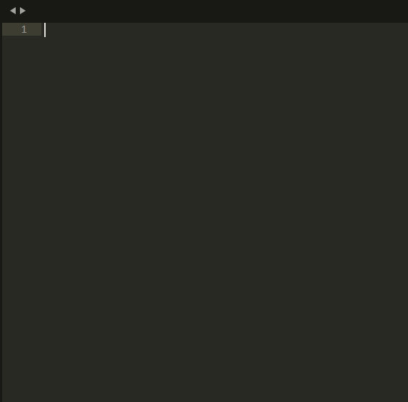

# Sublime 3 Dlang Auto File Name

Sublime 3 Dlang Auto File Name plugin. 
Set name for new file. Detect from "module ...", "class ...", "interface ...", "struct ..."

## Demo

## Algo
- Check for it is new unsaved file
- Get name
- - Grep for "\<module name\>"
- - Grep for "\<class Name\>"
- - Grep for "\<interface Name\>"
- - Grep for "\<struct Name\>"
- - Grep for "\<void Name\>"
- Set tab name. It will be file name.

## Installation

Install [DlangAutoFileName](https://packagecontrol.io/packages/DlangAutoFileName) from Package Control.
